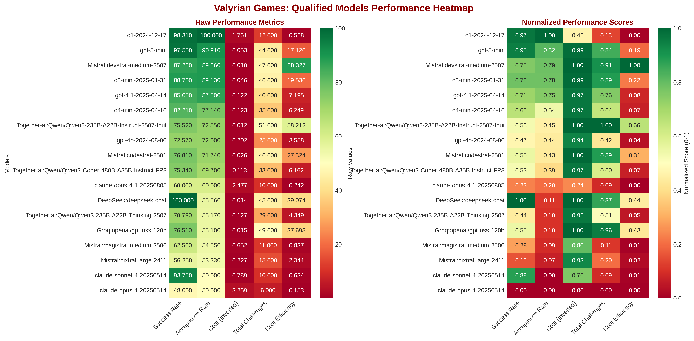

# Valyrian Games: Olympics of AI

**The Ultimate AI Model Benchmarking Platform**

Welcome to the Valyrian Games, an advanced AI benchmarking system that evaluates Large Language Models (LLMs) through rigorous coding challenges. This platform serves as the "Olympics of AI," providing comprehensive performance analytics, cost analysis, and qualification metrics for AI models across multiple providers.

## 🎯 System Overview

The Valyrian Games platform is a sophisticated benchmarking ecosystem designed to:

- **Automatically generate coding challenges** using AI models
- **Validate challenge quality** through multi-attempt solving
- **Track comprehensive performance metrics** including cost, speed, and accuracy
- **Provide executive-grade analytics** with professional visualizations
- **Support automated model qualification** based on performance thresholds
- **Enable cost-aware model selection** for optimal resource utilization

## 🏗️ Architecture

The system consists of four core components working in harmony:

### 1. **Challenge Generation & Execution** (`run_coding_challenge_phase_1.py`)
The foundation script that orchestrates the complete challenge workflow:

- **Docker Environment Management**: Automatically restarts containers for clean execution
- **Challenge Creation**: Generates unique coding problems using specified LLM models
- **Multi-Attempt Validation**: Tests each challenge multiple times to ensure solvability
- **Performance Tracking**: Records tokens, costs, timing, and accuracy metrics
- **Automated Classification**: Sorts results into `accepted/` or `rejected/` directories
- **Statistics Integration**: Automatically triggers analysis updates after completion

**Key Features:**
- Configurable validation attempts (default: 3)
- Adjustable success thresholds (default: 50%)
- Timeout handling with graceful failure recording
- Comprehensive conversation metrics extraction
- Real-time progress monitoring with detailed logging

### 2. **Intelligent Model Selection** (`run_random_coding_challenge.py`)
Advanced orchestration system for automated testing across the entire model fleet:

- **Cost-Aware Selection**: Prioritizes cheaper models and those with fewer existing challenges
- **Dynamic Disqualification**: Two-tier system removes poorly performing models
  - **Early Disqualification**: ≥3 rejected challenges with 0 accepted
  - **Statistical Disqualification**: <50% acceptance rate after 10+ challenges
- **Weighted Random Selection**: Balances data collection across models using cost and challenge count
- **Qualified Model Pool**: Automatically loads qualified models from cost analysis data
- **Batch Execution**: Supports multiple runs with configurable delays
- **Auto-Visualization**: Generates updated charts after successful runs

**Supported Model Providers:**
- **OpenAI**: GPT-4.1, GPT-4o, O1, O3, O4 series (62+ models)
- **Anthropic**: Claude Opus, Sonnet, Haiku series
- **Google**: Gemini 2.5, 2.0, 1.5 series
- **Mistral**: Magistral, Codestral, Devstral, Ministral series
- **DeepSeek**: Chat and reasoning models
- **Together.ai**: DeepSeek-R1, Qwen, GLM, Llama variants
- **Groq**: High-speed inference models

### 3. **Comprehensive Analytics Engine** (`analyze_challenge_statistics.py`)
Sophisticated statistical analysis system that processes all challenge results:

- **Multi-Dimensional Metrics**: Acceptance rate, success rate, cost efficiency, token usage
- **Nested Directory Support**: Handles complex provider structures (Together.ai, Groq)
- **Qualification Determination**: Automatic model qualification based on performance criteria
- **Cost Summary Generation**: Creates `model_cost_summary.json` for downstream systems
- **Executive Reporting**: Generates detailed markdown reports with model rankings
- **Auto-Visualization Trigger**: Launches chart generation after analysis completion

**Generated Outputs:**
- `qualification_results.md`: Comprehensive performance report
- `model_cost_summary.json`: Structured data for visualizations and model selection
- Console reports with sortable metrics and detailed breakdowns

### 4. **Professional Visualization Suite** (`visualize_model_analytics.py`)
Executive-grade analytics dashboard with four distinct visualization types:

#### **Cost vs Performance Scatter Plot**

- **X-Axis**: Acceptance Rate (%) - primary performance metric
- **Y-Axis**: Average Cost per Challenge ($) - logarithmic scale for better distribution
- **Bubble Size**: Total challenges completed
- **Color Coding**: Green (qualified) vs Red (disqualified)
- **Smart Labeling**: Collision-aware model name placement

#### **Model Comparison Bar Charts**

- **Dual Charts**: Acceptance rates and costs side-by-side
- **Sorted Rankings**: Performance-based ordering for easy comparison
- **Value Labels**: Precise metrics displayed on each bar
- **Qualification Status**: Color-coded qualification indicators

#### **Executive Dashboard**

- **Qualification Overview**: Pie chart showing qualified vs disqualified models
- **Top Performers**: Top 5 models by acceptance rate
- **Cost Efficiency Analysis**: Acceptance rate divided by cost with negative values for disqualified models
- **Key Metrics Summary**: Total models, qualification rates, averages, and top performers
- **Adaptive Labeling**: Smart label reduction for crowded charts
- **Professional Sizing**: 20×14 inches optimized for presentations

#### **Performance Heatmap**

- **Multi-Dimensional View**: Success rate, acceptance rate, cost, challenges, efficiency
- **Dual Visualization**: Raw values and normalized scores (0-1 scale)
- **Acceptance Rate Sorting**: Models ordered by performance for easy pattern recognition
- **Color Mapping**: Red-Yellow-Green scale for intuitive interpretation

## 📊 Key Metrics & Terminology

### **Performance Metrics**
- **Acceptance Rate**: Percentage of challenges that meet the success threshold (primary metric)
- **Success Rate**: Overall percentage of correct solution attempts across all challenges
- **Cost Efficiency**: Acceptance rate divided by average cost per challenge
- **Qualification Status**: Models with ≥50% acceptance rate after sufficient testing

### **Cost Analysis**
- **Average Cost per Challenge**: Total cost divided by number of challenges
- **Token Efficiency**: Tokens per second during challenge execution
- **Cost-Performance Ratio**: Balances model capability with economic efficiency

### **Challenge Classification**
- **Accepted Challenges**: Meet or exceed the success threshold (default: 50%)
- **Rejected Challenges**: Fall below the success threshold or timeout
- **Validation Attempts**: Number of solution attempts per challenge (default: 3)

## 🚀 Quick Start Guide

### **Running Individual Challenges**
```bash
# Run a single challenge with specific model
python3 run_coding_challenge_phase_1.py \
    --model "OpenAI:gpt-4.1-2025-04-14" \
    --temperature 0.7 \
    --validation-attempts 3 \
    --success-threshold 0.5
```

### **Automated Fleet Testing**
```bash
# Run random challenges across qualified models
python3 run_random_coding_challenge.py \
    --runs 10 \
    --delay-between-runs 30 \
    --disqualification-threshold 3 \
    --verbose

# Include expensive models in selection
python3 run_random_coding_challenge.py \
    --include-expensive \
    --runs 5
```

### **Analytics Generation**
```bash
# Analyze all results and generate reports
python3 analyze_challenge_statistics.py \
    --base-directory /volumes/Serendipity/ValyrianGames/CodingChallenge \
    --save-markdown \
    --sort-by acceptance_rate

# Generate all visualizations
python3 visualize_model_analytics.py \
    --data-file model_cost_summary.json \
    --chart all \
    --save \
    --format png
```

## 📁 Directory Structure

```
/volumes/Serendipity/ValyrianGames/CodingChallenge/
├── README.md                           # This comprehensive guide
├── model_cost_summary.json             # Structured performance data
├── qualification_results.md            # Detailed analysis report
├── valyrian_games_cost_performance.png # Cost vs performance chart
├── valyrian_games_model_comparison.png # Model comparison bars
├── valyrian_games_dashboard.png        # Executive dashboard
├── valyrian_games_heatmap.png         # Performance heatmap
├── OpenAI:gpt-4.1-2025-04-14/         # Model-specific results
│   ├── accepted/                       # Successful challenges
│   │   ├── conversation_001.json       # Challenge result with metrics
│   │   └── conversation_002.json
│   └── rejected/                       # Failed challenges
│       ├── conversation_003.json       # Failed challenge with reason
│       └── conversation_004.json
├── Anthropic:claude-3-5-sonnet-20241022/
│   ├── accepted/
│   └── rejected/
└── [Additional model directories...]
```

## 🎮 Challenge Result Format

Each challenge result is stored as a comprehensive JSON file containing:

```json
{
  "conversation_id": "unique_identifier",
  "timestamp": "2025-01-29T12:00:00",
  "status": "ACCEPTED|REJECTED",
  "parameters": {
    "validation_attempts": 3,
    "success_threshold": 0.5,
    "agent": "Contender"
  },
  "challenge": {
    "challenge_prompt": "Create a function that...",
    "example_code": "def solution():",
    "expected_answer": 42
  },
  "validation_results": {
    "total_attempts": 3,
    "correct_answers": 2,
    "success_rate": 0.67,
    "accepted": true
  },
  "performance_metrics": {
    "model_name": "OpenAI:gpt-4.1-2025-04-14",
    "temperature": 0.7,
    "total_completion_tokens": 1250,
    "total_cost": 0.0125,
    "total_elapsed_time": 45.2,
    "tokens_per_second": 27.6
  },
  "solution_attempts": [
    {
      "filename": "challenge_candidate_solution_1.json",
      "answer": 42,
      "python_code": "def solution(): return 42",
      "is_correct": true
    }
  ]
}
```

## 🏆 Qualification System

### **Qualification Criteria**
Models are automatically qualified based on:
1. **Minimum Challenges**: At least 1 completed challenge
2. **Acceptance Threshold**: ≥50% acceptance rate
3. **Statistical Significance**: Performance maintained over multiple challenges

### **Disqualification Rules**
Models are disqualified through a two-tier system:
1. **Early Disqualification**: ≥3 rejected challenges with 0 accepted
2. **Statistical Disqualification**: <50% acceptance rate after 10+ challenges

### **Re-qualification**
Disqualified models can re-qualify by:
- Achieving successful challenge completions
- Improving acceptance rate above 50%
- Demonstrating consistent performance over time

## 💡 Advanced Features

### **Cost-Aware Selection**
The system intelligently balances:
- **Model Performance**: Prioritizes higher-performing models
- **Cost Efficiency**: Favors economical models for budget optimization
- **Data Balance**: Ensures comprehensive testing across all models
- **Quality Control**: Automatically removes consistently poor performers

### **Docker Integration**
- **Clean Execution Environment**: Containers restart before each challenge
- **Isolation**: Prevents cross-contamination between challenges
- **Reliability**: Ensures consistent execution conditions
- **Scalability**: Supports concurrent challenge execution

### **Automated Workflows**
- **End-to-End Automation**: From challenge generation to visualization
- **Failure Handling**: Graceful timeout and error management
- **Progress Tracking**: Real-time status updates and logging
- **Integration**: Seamless data flow between all components


## 🔧 Configuration Options

### **Challenge Parameters**
- `--validation-attempts`: Number of solution attempts (1-10)
- `--success-threshold`: Minimum success rate (0.0-1.0)
- `--temperature`: Model creativity parameter (0.0-2.0)
- `--solution-timeout`: Maximum time per solution (seconds)

### **Selection Parameters**
- `--disqualification-threshold`: Rejection limit before disqualification
- `--include-expensive`: Include high-cost models in selection
- `--category`: Test specific model categories only
- `--use-static-pool`: Use hardcoded model list instead of qualified models

### **Output Parameters**
- `--save-markdown`: Generate detailed markdown reports
- `--sort-by`: Sort results by specific metrics
- `--verbose`: Enable detailed logging and progress updates
- `--format`: Chart output format (png, svg, pdf)

## 🎯 Use Cases

### **AI Research & Development**
- **Model Comparison**: Objective performance benchmarking
- **Cost Analysis**: Budget optimization for AI deployments
- **Capability Assessment**: Understanding model strengths and limitations
- **Trend Analysis**: Tracking performance improvements over time

### **Enterprise AI Strategy**
- **Vendor Selection**: Data-driven model provider decisions
- **Budget Planning**: Cost forecasting for AI initiatives
- **Performance Monitoring**: Ongoing model evaluation
- **Risk Assessment**: Identifying reliable vs unreliable models

### **Academic Research**
- **Benchmarking Studies**: Standardized model evaluation
- **Performance Analysis**: Statistical model comparison
- **Cost-Benefit Research**: Economic efficiency studies
- **Longitudinal Studies**: Model evolution tracking

## 🔧 System Requirements

- **Python 3.8+** with required dependencies
- **Docker** for containerized execution environment
- **Sufficient Storage** for challenge results and visualizations
- **API Access** to supported LLM providers

### **Dependencies**
```bash
pip install matplotlib seaborn pandas numpy requests
```

## 🏁 Conclusion

The Valyrian Games represents the pinnacle of AI model benchmarking, providing unprecedented insights into LLM performance, cost efficiency, and reliability. Through rigorous testing, comprehensive analytics, and professional visualizations, this platform empowers organizations to make informed decisions about AI model selection and deployment.

Whether you're conducting academic research, optimizing enterprise AI costs, or simply curious about the latest AI capabilities, the Valyrian Games provides the tools and insights needed to navigate the rapidly evolving landscape of artificial intelligence.

**Welcome to the Olympics of AI – may the best models win! 🏆**

---

*Generated by the Valyrian Games Analytics System*  
*Last Updated: 2025-01-29*
