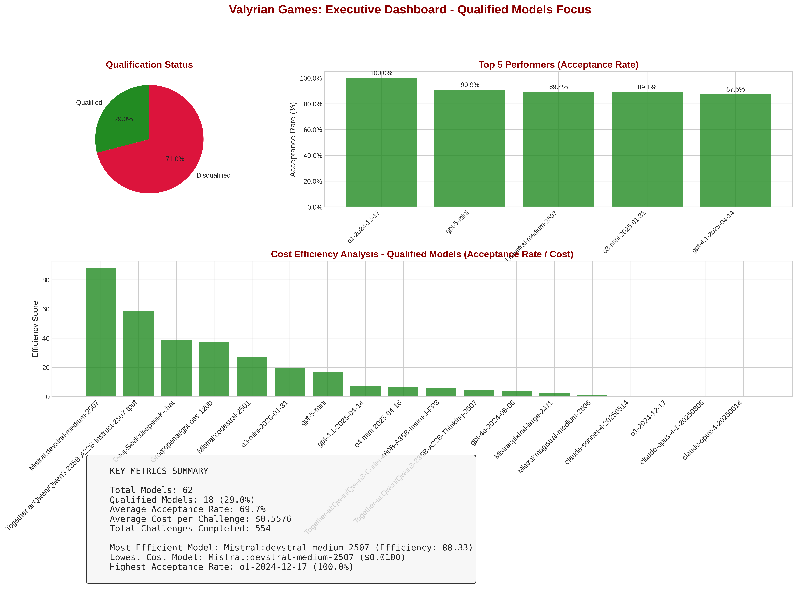
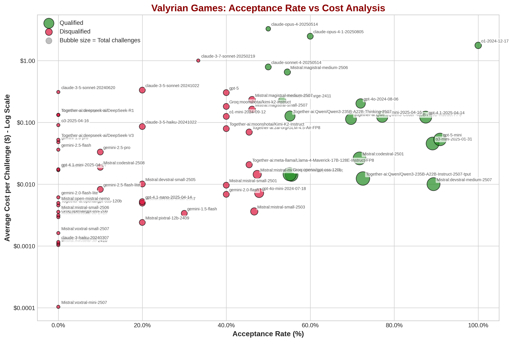
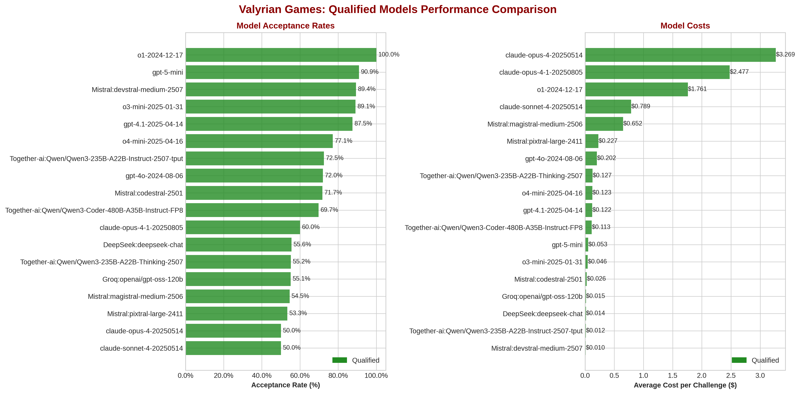

# Valyrian Games - Coding Challenge Statistics Report

**Generated:** 2025-08-31 16:39:29
**Sorted by:** Acceptance Rate

## Visual Analytics Overview

### Executive Dashboard

### Cost vs Performance Analysis

### Model Comparison

### Performance Heatmap

## Model Performance Summary

| Model                                         | Challenges | Accept% | Success% | Avg Cost  | Efficiency |
|-----------------------------------------------|------------|---------|----------|-----------|------------|
| OpenAI:o1-2024-12-17                          |      11/11 |  100.0% |    98.2% |    $1.667 |   96.4 t/s |
| OpenAI:gpt-5-mini                             |      37/41 |   90.2% |    97.4% |    $0.052 |   62.6 t/s |
| Mistral:devstral-medium-2507                  |      43/48 |   89.6% |    88.8% |    $0.011 |   80.1 t/s |
| OpenAI:o3-mini-2025-01-31                     |      39/44 |   88.6% |    88.6% |    $0.045 |  108.2 t/s |
| OpenAI:gpt-4.1-2025-04-14                     |      34/39 |   87.2% |    84.7% |    $0.122 |   57.8 t/s |
| OpenAI:o4-mini-2025-04-16                     |      26/34 |   76.5% |    81.6% |    $0.123 |   88.3 t/s |
| Together-ai:Qwen/Qwen3-235B-A22B-Instruct-... |      37/50 |   74.0% |    77.1% |    $0.012 |   45.3 t/s |
| OpenAI:gpt-4o-2024-08-06                      |      18/25 |   72.0% |    74.3% |    $0.201 |   62.3 t/s |
| Mistral:codestral-2501                        |      32/45 |   71.1% |    76.8% |    $0.025 |  173.5 t/s |
| Together-ai:Qwen/Qwen3-Coder-480B-A35B-Ins... |      23/33 |   69.7% |    75.3% |    $0.113 |   36.9 t/s |
| Mistral:pixtral-large-2411                    |      11/18 |   61.1% |    60.8% |    $0.224 |   37.7 t/s |
| DeepSeek:deepseek-chat                        |      23/38 |   60.5% |   100.0% |    $0.015 |   17.8 t/s |
| Anthropic:claude-opus-4-1-20250805            |       6/10 |   60.0% |    60.0% |    $2.477 |   40.1 t/s |
| Groq:openai/gpt-oss-120b                      |      27/48 |   56.2% |    77.4% |    $0.014 |  230.2 t/s |
| Together-ai:Qwen/Qwen3-235B-A22B-Thinking-... |      16/29 |   55.2% |    70.8% |    $0.127 |   50.7 t/s |
| Mistral:magistral-medium-2506                 |       6/11 |   54.5% |    62.5% |    $0.652 |  118.8 t/s |
| Anthropic:claude-opus-4-20250514              |        3/6 |   50.0% |    48.0% |    $3.269 |   62.0 t/s |
| Anthropic:claude-sonnet-4-20250514            |       5/10 |   50.0% |    93.8% |    $0.789 |   62.5 t/s |
| OpenAI:gpt-4o-mini-2024-07-18                 |      11/23 |   47.8% |    54.8% |    $0.007 |   41.3 t/s |
| Mistral:mistral-medium-2505                   |       9/19 |   47.4% |    47.1% |    $0.014 |   49.6 t/s |
| Mistral:mistral-small-2503                    |       7/15 |   46.7% |    50.0% |    $0.004 |  120.5 t/s |
| Mistral:magistral-medium-2507                 |       6/13 |   46.2% |    53.3% |    $0.232 |   82.0 t/s |
| Mistral:magistral-small-2507                  |       6/13 |   46.2% |    84.6% |    $0.161 |  170.2 t/s |
| Together-ai:meta-llama/Llama-4-Maverick-17... |       5/11 |   45.5% |    40.0% |    $0.021 |   47.3 t/s |
| Together-ai:zai-org/GLM-4.5-Air-FP8           |       5/11 |   45.5% |    55.8% |    $0.070 |  184.2 t/s |
| Google:gemini-2.0-flash                       |       4/10 |   40.0% |    36.0% |    $0.007 |   99.0 t/s |
| Groq:moonshotai/kimi-k2-instruct              |       4/10 |   40.0% |    28.9% |    $0.181 |  263.2 t/s |
| Mistral:mistral-small-2501                    |       4/10 |   40.0% |    48.8% |    $0.010 |  136.3 t/s |
| OpenAI:gpt-5                                  |       4/10 |   40.0% |   100.0% |    $0.303 |   57.9 t/s |
| OpenAI:o1-mini-2024-09-12                     |       4/10 |   40.0% |    46.5% |    $0.125 |  181.7 t/s |
| Together-ai:moonshotai/Kimi-K2-Instruct       |       4/10 |   40.0% |    44.1% |    $0.079 |   18.3 t/s |
| Anthropic:claude-3-7-sonnet-20250219          |        1/3 |   33.3% |    23.1% |    $1.000 |   74.1 t/s |
| Google:gemini-1.5-flash                       |       3/10 |   30.0% |    30.0% |    $0.003 |   47.2 t/s |
| Anthropic:claude-3-5-haiku-20241022           |       2/10 |   20.0% |    14.9% |    $0.086 |   63.8 t/s |
| Anthropic:claude-3-5-sonnet-20241022          |       2/10 |   20.0% |    36.0% |    $0.333 |   49.3 t/s |
| Mistral:devstral-small-2505                   |       2/10 |   20.0% |    30.3% |    $0.010 |  171.3 t/s |
| Mistral:devstral-small-2507                   |       2/10 |   20.0% |    26.0% |    $0.005 |  145.4 t/s |
| Mistral:pixtral-12b-2409                      |       2/10 |   20.0% |    32.5% |    $0.002 |   69.9 t/s |
| OpenAI:gpt-4.1-nano-2025-04-14                |       2/10 |   20.0% |    50.0% |    $0.005 |  112.9 t/s |
| Google:gemini-2.5-flash-lite                  |       1/10 |   10.0% |    17.8% |    $0.008 |  201.9 t/s |
| Google:gemini-2.5-pro                         |       1/10 |   10.0% |   100.0% |    $0.033 |    9.3 t/s |
| Mistral:codestral-2508                        |       1/10 |   10.0% |    17.9% |    $0.019 |  157.8 t/s |
| Anthropic:claude-3-5-sonnet-20240620          |        0/3 |    0.0% |     0.0% |    $0.310 |   65.9 t/s |
| Anthropic:claude-3-haiku-20240307             |        0/3 |    0.0% |     0.0% |    $0.001 |   83.4 t/s |
| Google:gemini-1.5-flash-8b                    |        0/3 |    0.0% |     0.0% |    $0.001 |   83.9 t/s |
| Google:gemini-1.5-pro                         |        0/3 |    0.0% |     0.0% |    $0.048 |   40.8 t/s |
| Google:gemini-2.0-flash-lite                  |        0/3 |    0.0% |     0.0% |    $0.006 |  118.6 t/s |
| Google:gemini-2.5-flash                       |        0/3 |    0.0% |     9.1% |    $0.036 |   21.0 t/s |
| Groq:openai/gpt-oss-20b                       |        0/3 |    0.0% |     0.0% |    $0.003 |  320.2 t/s |
| Mistral:ministral-3b-2410                     |        0/3 |    0.0% |     0.0% |    $0.001 |  137.9 t/s |
| Mistral:ministral-8b-2410                     |        0/3 |    0.0% |     0.0% |    $0.003 |   84.3 t/s |
| Mistral:mistral-large-2411                    |        0/3 |    0.0% |     0.0% |    $0.132 |   50.2 t/s |
| Mistral:mistral-small-2506                    |        0/3 |    0.0% |    13.3% |    $0.004 |   52.7 t/s |
| Mistral:open-mistral-nemo                     |        0/3 |    0.0% |    20.0% |    $0.005 |  143.5 t/s |
| Mistral:voxtral-mini-2507                     |        0/3 |    0.0% |     0.0% |    $0.000 |  175.8 t/s |
| Mistral:voxtral-small-2507                    |        0/3 |    0.0% |    14.3% |    $0.002 |   83.9 t/s |
| OpenAI:gpt-4.1-mini-2025-04-14                |        0/3 |    0.0% |     6.7% |    $0.017 |   53.5 t/s |
| OpenAI:gpt-5-nano                             |        0/3 |    0.0% |     0.0% |    $0.017 |  187.7 t/s |
| OpenAI:o3-2025-04-16                          |        0/3 |    0.0% |     0.0% |    $0.090 |   63.9 t/s |
| Together-ai:deepseek-ai/DeepSeek-R1           |        0/3 |    0.0% |     0.0% |    $0.132 |   37.1 t/s |
| Together-ai:deepseek-ai/DeepSeek-V3           |        0/3 |    0.0% |     0.0% |    $0.052 |   29.8 t/s |
| Together-ai:openai/gpt-oss-120b               |        0/3 |    0.0% |     0.0% |    $0.005 |  111.9 t/s |

## OpenAI:o1-2024-12-17

### Challenge Summary
- **Total Challenges:** 11
- **Accepted:** 11 (100.0%)
- **Rejected:** 0 (0.0%)

### Success Rate Analysis
- **Total Solution Attempts:** 55
- **Correct Attempts:** 54
- **Overall Success Rate:** 98.2%
- **Average Success Rate per Challenge:** 98.2%

### Performance Metrics
- **Total Tokens:** 216,540
- **Total Cost:** $18.3413
- **Total Time:** 2247.0 seconds
- **Average Tokens per Challenge:** 19685
- **Average Cost per Challenge:** $1.6674
- **Average Time per Challenge:** 204.3 seconds
- **Average Efficiency:** 96.4 tokens/second

## OpenAI:gpt-5-mini

### Challenge Summary
- **Total Challenges:** 41
- **Accepted:** 37 (90.2%)
- **Rejected:** 4 (9.8%)

### Success Rate Analysis
- **Total Solution Attempts:** 189
- **Correct Attempts:** 184
- **Overall Success Rate:** 97.4%
- **Average Success Rate per Challenge:** 90.2%

### Performance Metrics
- **Total Tokens:** 893,819
- **Total Cost:** $2.1517
- **Total Time:** 14272.3 seconds
- **Average Tokens per Challenge:** 21800
- **Average Cost per Challenge:** $0.0525
- **Average Time per Challenge:** 348.1 seconds
- **Average Efficiency:** 62.6 tokens/second

## Mistral:devstral-medium-2507

### Challenge Summary
- **Total Challenges:** 48
- **Accepted:** 43 (89.6%)
- **Rejected:** 5 (10.4%)

### Success Rate Analysis
- **Total Solution Attempts:** 240
- **Correct Attempts:** 213
- **Overall Success Rate:** 88.8%
- **Average Success Rate per Challenge:** 88.7%

### Performance Metrics
- **Total Tokens:** 120,485
- **Total Cost:** $0.5070
- **Total Time:** 1505.0 seconds
- **Average Tokens per Challenge:** 2510
- **Average Cost per Challenge:** $0.0106
- **Average Time per Challenge:** 31.4 seconds
- **Average Efficiency:** 80.1 tokens/second

## OpenAI:o3-mini-2025-01-31

### Challenge Summary
- **Total Challenges:** 44
- **Accepted:** 39 (88.6%)
- **Rejected:** 5 (11.4%)

### Success Rate Analysis
- **Total Solution Attempts:** 220
- **Correct Attempts:** 195
- **Overall Success Rate:** 88.6%
- **Average Success Rate per Challenge:** 88.6%

### Performance Metrics
- **Total Tokens:** 326,067
- **Total Cost:** $1.9788
- **Total Time:** 3012.7 seconds
- **Average Tokens per Challenge:** 7411
- **Average Cost per Challenge:** $0.0450
- **Average Time per Challenge:** 68.5 seconds
- **Average Efficiency:** 108.2 tokens/second

## OpenAI:gpt-4.1-2025-04-14

### Challenge Summary
- **Total Challenges:** 39
- **Accepted:** 34 (87.2%)
- **Rejected:** 5 (12.8%)

### Success Rate Analysis
- **Total Solution Attempts:** 189
- **Correct Attempts:** 160
- **Overall Success Rate:** 84.7%
- **Average Success Rate per Challenge:** 82.6%

### Performance Metrics
- **Total Tokens:** 190,999
- **Total Cost:** $4.7641
- **Total Time:** 3305.6 seconds
- **Average Tokens per Challenge:** 4897
- **Average Cost per Challenge:** $0.1222
- **Average Time per Challenge:** 84.8 seconds
- **Average Efficiency:** 57.8 tokens/second

## OpenAI:o4-mini-2025-04-16

### Challenge Summary
- **Total Challenges:** 34
- **Accepted:** 26 (76.5%)
- **Rejected:** 8 (23.5%)

### Success Rate Analysis
- **Total Solution Attempts:** 158
- **Correct Attempts:** 129
- **Overall Success Rate:** 81.6%
- **Average Success Rate per Challenge:** 76.5%

### Performance Metrics
- **Total Tokens:** 682,697
- **Total Cost:** $4.1929
- **Total Time:** 7735.7 seconds
- **Average Tokens per Challenge:** 20079
- **Average Cost per Challenge:** $0.1233
- **Average Time per Challenge:** 227.5 seconds
- **Average Efficiency:** 88.3 tokens/second

## Together-ai:Qwen/Qwen3-235B-A22B-Instruct-2507-tput

### Challenge Summary
- **Total Challenges:** 50
- **Accepted:** 37 (74.0%)
- **Rejected:** 13 (26.0%)

### Success Rate Analysis
- **Total Solution Attempts:** 236
- **Correct Attempts:** 182
- **Overall Success Rate:** 77.1%
- **Average Success Rate per Challenge:** 74.4%

### Performance Metrics
- **Total Tokens:** 282,295
- **Total Cost:** $0.6200
- **Total Time:** 6230.2 seconds
- **Average Tokens per Challenge:** 5646
- **Average Cost per Challenge:** $0.0124
- **Average Time per Challenge:** 124.6 seconds
- **Average Efficiency:** 45.3 tokens/second

## OpenAI:gpt-4o-2024-08-06

### Challenge Summary
- **Total Challenges:** 25
- **Accepted:** 18 (72.0%)
- **Rejected:** 7 (28.0%)

### Success Rate Analysis
- **Total Solution Attempts:** 113
- **Correct Attempts:** 84
- **Overall Success Rate:** 74.3%
- **Average Success Rate per Challenge:** 68.8%

### Performance Metrics
- **Total Tokens:** 151,578
- **Total Cost:** $5.0151
- **Total Time:** 2432.8 seconds
- **Average Tokens per Challenge:** 6063
- **Average Cost per Challenge:** $0.2006
- **Average Time per Challenge:** 97.3 seconds
- **Average Efficiency:** 62.3 tokens/second

## Mistral:codestral-2501

### Challenge Summary
- **Total Challenges:** 45
- **Accepted:** 32 (71.1%)
- **Rejected:** 13 (28.9%)

### Success Rate Analysis
- **Total Solution Attempts:** 203
- **Correct Attempts:** 156
- **Overall Success Rate:** 76.8%
- **Average Success Rate per Challenge:** 71.1%

### Performance Metrics
- **Total Tokens:** 516,788
- **Total Cost:** $1.1127
- **Total Time:** 2978.1 seconds
- **Average Tokens per Challenge:** 11484
- **Average Cost per Challenge:** $0.0247
- **Average Time per Challenge:** 66.2 seconds
- **Average Efficiency:** 173.5 tokens/second

## Together-ai:Qwen/Qwen3-Coder-480B-A35B-Instruct-FP8

### Challenge Summary
- **Total Challenges:** 33
- **Accepted:** 23 (69.7%)
- **Rejected:** 10 (30.3%)

### Success Rate Analysis
- **Total Solution Attempts:** 146
- **Correct Attempts:** 110
- **Overall Success Rate:** 75.3%
- **Average Success Rate per Challenge:** 68.3%

### Performance Metrics
- **Total Tokens:** 219,513
- **Total Cost:** $3.7293
- **Total Time:** 5943.7 seconds
- **Average Tokens per Challenge:** 6652
- **Average Cost per Challenge:** $0.1130
- **Average Time per Challenge:** 180.1 seconds
- **Average Efficiency:** 36.9 tokens/second

## Mistral:pixtral-large-2411

### Challenge Summary
- **Total Challenges:** 18
- **Accepted:** 11 (61.1%)
- **Rejected:** 7 (38.9%)

### Success Rate Analysis
- **Total Solution Attempts:** 79
- **Correct Attempts:** 48
- **Overall Success Rate:** 60.8%
- **Average Success Rate per Challenge:** 58.9%

### Performance Metrics
- **Total Tokens:** 211,094
- **Total Cost:** $4.0368
- **Total Time:** 5594.4 seconds
- **Average Tokens per Challenge:** 11727
- **Average Cost per Challenge:** $0.2243
- **Average Time per Challenge:** 310.8 seconds
- **Average Efficiency:** 37.7 tokens/second

## DeepSeek:deepseek-chat

### Challenge Summary
- **Total Challenges:** 38
- **Accepted:** 23 (60.5%)
- **Rejected:** 15 (39.5%)

### Success Rate Analysis
- **Total Solution Attempts:** 103
- **Correct Attempts:** 103
- **Overall Success Rate:** 100.0%
- **Average Success Rate per Challenge:** 60.5%

### Performance Metrics
- **Total Tokens:** 230,055
- **Total Cost:** $0.5540
- **Total Time:** 12937.5 seconds
- **Average Tokens per Challenge:** 6054
- **Average Cost per Challenge:** $0.0146
- **Average Time per Challenge:** 340.5 seconds
- **Average Efficiency:** 17.8 tokens/second

## Anthropic:claude-opus-4-1-20250805

### Challenge Summary
- **Total Challenges:** 10
- **Accepted:** 6 (60.0%)
- **Rejected:** 4 (40.0%)

### Success Rate Analysis
- **Total Solution Attempts:** 50
- **Correct Attempts:** 30
- **Overall Success Rate:** 60.0%
- **Average Success Rate per Challenge:** 60.0%

### Performance Metrics
- **Total Tokens:** 182,524
- **Total Cost:** $24.7694
- **Total Time:** 4554.3 seconds
- **Average Tokens per Challenge:** 18252
- **Average Cost per Challenge:** $2.4769
- **Average Time per Challenge:** 455.4 seconds
- **Average Efficiency:** 40.1 tokens/second

## Groq:openai/gpt-oss-120b

### Challenge Summary
- **Total Challenges:** 48
- **Accepted:** 27 (56.2%)
- **Rejected:** 21 (43.8%)

### Success Rate Analysis
- **Total Solution Attempts:** 164
- **Correct Attempts:** 127
- **Overall Success Rate:** 77.4%
- **Average Success Rate per Challenge:** 55.8%

### Performance Metrics
- **Total Tokens:** 732,158
- **Total Cost:** $0.6927
- **Total Time:** 3180.4 seconds
- **Average Tokens per Challenge:** 15253
- **Average Cost per Challenge:** $0.0144
- **Average Time per Challenge:** 66.3 seconds
- **Average Efficiency:** 230.2 tokens/second

## Together-ai:Qwen/Qwen3-235B-A22B-Thinking-2507

### Challenge Summary
- **Total Challenges:** 29
- **Accepted:** 16 (55.2%)
- **Rejected:** 13 (44.8%)

### Success Rate Analysis
- **Total Solution Attempts:** 89
- **Correct Attempts:** 63
- **Overall Success Rate:** 70.8%
- **Average Success Rate per Challenge:** 53.6%

### Performance Metrics
- **Total Tokens:** 919,507
- **Total Cost:** $3.6763
- **Total Time:** 18153.6 seconds
- **Average Tokens per Challenge:** 31707
- **Average Cost per Challenge:** $0.1268
- **Average Time per Challenge:** 626.0 seconds
- **Average Efficiency:** 50.7 tokens/second

## Mistral:magistral-medium-2506

### Challenge Summary
- **Total Challenges:** 11
- **Accepted:** 6 (54.5%)
- **Rejected:** 5 (45.5%)

### Success Rate Analysis
- **Total Solution Attempts:** 16
- **Correct Attempts:** 10
- **Overall Success Rate:** 62.5%
- **Average Success Rate per Challenge:** 54.5%

### Performance Metrics
- **Total Tokens:** 860,663
- **Total Cost:** $7.1706
- **Total Time:** 7245.9 seconds
- **Average Tokens per Challenge:** 78242
- **Average Cost per Challenge:** $0.6519
- **Average Time per Challenge:** 658.7 seconds
- **Average Efficiency:** 118.8 tokens/second

## Anthropic:claude-opus-4-20250514

### Challenge Summary
- **Total Challenges:** 6
- **Accepted:** 3 (50.0%)
- **Rejected:** 3 (50.0%)

### Success Rate Analysis
- **Total Solution Attempts:** 25
- **Correct Attempts:** 12
- **Overall Success Rate:** 48.0%
- **Average Success Rate per Challenge:** 44.4%

### Performance Metrics
- **Total Tokens:** 148,896
- **Total Cost:** $19.6127
- **Total Time:** 2401.6 seconds
- **Average Tokens per Challenge:** 24816
- **Average Cost per Challenge:** $3.2688
- **Average Time per Challenge:** 400.3 seconds
- **Average Efficiency:** 62.0 tokens/second

## Anthropic:claude-sonnet-4-20250514

### Challenge Summary
- **Total Challenges:** 10
- **Accepted:** 5 (50.0%)
- **Rejected:** 5 (50.0%)

### Success Rate Analysis
- **Total Solution Attempts:** 16
- **Correct Attempts:** 15
- **Overall Success Rate:** 93.8%
- **Average Success Rate per Challenge:** 50.0%

### Performance Metrics
- **Total Tokens:** 276,608
- **Total Cost:** $7.8889
- **Total Time:** 4424.7 seconds
- **Average Tokens per Challenge:** 27661
- **Average Cost per Challenge:** $0.7889
- **Average Time per Challenge:** 442.5 seconds
- **Average Efficiency:** 62.5 tokens/second

## OpenAI:gpt-4o-mini-2024-07-18

### Challenge Summary
- **Total Challenges:** 23
- **Accepted:** 11 (47.8%)
- **Rejected:** 12 (52.2%)

### Success Rate Analysis
- **Total Solution Attempts:** 115
- **Correct Attempts:** 63
- **Overall Success Rate:** 54.8%
- **Average Success Rate per Challenge:** 54.8%

### Performance Metrics
- **Total Tokens:** 86,686
- **Total Cost:** $0.1654
- **Total Time:** 2098.7 seconds
- **Average Tokens per Challenge:** 3769
- **Average Cost per Challenge:** $0.0072
- **Average Time per Challenge:** 91.2 seconds
- **Average Efficiency:** 41.3 tokens/second

## Mistral:mistral-medium-2505

### Challenge Summary
- **Total Challenges:** 19
- **Accepted:** 9 (47.4%)
- **Rejected:** 10 (52.6%)

### Success Rate Analysis
- **Total Solution Attempts:** 85
- **Correct Attempts:** 40
- **Overall Success Rate:** 47.1%
- **Average Success Rate per Challenge:** 42.1%

### Performance Metrics
- **Total Tokens:** 68,355
- **Total Cost:** $0.2732
- **Total Time:** 1378.0 seconds
- **Average Tokens per Challenge:** 3598
- **Average Cost per Challenge:** $0.0144
- **Average Time per Challenge:** 72.5 seconds
- **Average Efficiency:** 49.6 tokens/second

## Mistral:mistral-small-2503

### Challenge Summary
- **Total Challenges:** 15
- **Accepted:** 7 (46.7%)
- **Rejected:** 8 (53.3%)

### Success Rate Analysis
- **Total Solution Attempts:** 70
- **Correct Attempts:** 35
- **Overall Success Rate:** 50.0%
- **Average Success Rate per Challenge:** 46.7%

### Performance Metrics
- **Total Tokens:** 59,146
- **Total Cost:** $0.0544
- **Total Time:** 490.7 seconds
- **Average Tokens per Challenge:** 3943
- **Average Cost per Challenge:** $0.0036
- **Average Time per Challenge:** 32.7 seconds
- **Average Efficiency:** 120.5 tokens/second

## Mistral:magistral-medium-2507

### Challenge Summary
- **Total Challenges:** 13
- **Accepted:** 6 (46.2%)
- **Rejected:** 7 (53.8%)

### Success Rate Analysis
- **Total Solution Attempts:** 30
- **Correct Attempts:** 16
- **Overall Success Rate:** 53.3%
- **Average Success Rate per Challenge:** 42.3%

### Performance Metrics
- **Total Tokens:** 318,976
- **Total Cost:** $3.0139
- **Total Time:** 3890.9 seconds
- **Average Tokens per Challenge:** 24537
- **Average Cost per Challenge:** $0.2318
- **Average Time per Challenge:** 299.3 seconds
- **Average Efficiency:** 82.0 tokens/second

## Mistral:magistral-small-2507

### Challenge Summary
- **Total Challenges:** 13
- **Accepted:** 6 (46.2%)
- **Rejected:** 7 (53.8%)

### Success Rate Analysis
- **Total Solution Attempts:** 13
- **Correct Attempts:** 11
- **Overall Success Rate:** 84.6%
- **Average Success Rate per Challenge:** 46.2%

### Performance Metrics
- **Total Tokens:** 851,882
- **Total Cost:** $2.0990
- **Total Time:** 5005.1 seconds
- **Average Tokens per Challenge:** 65529
- **Average Cost per Challenge:** $0.1615
- **Average Time per Challenge:** 385.0 seconds
- **Average Efficiency:** 170.2 tokens/second

## Together-ai:meta-llama/Llama-4-Maverick-17B-128E-Instruct-FP8

### Challenge Summary
- **Total Challenges:** 11
- **Accepted:** 5 (45.5%)
- **Rejected:** 6 (54.5%)

### Success Rate Analysis
- **Total Solution Attempts:** 55
- **Correct Attempts:** 22
- **Overall Success Rate:** 40.0%
- **Average Success Rate per Challenge:** 40.0%

### Performance Metrics
- **Total Tokens:** 82,915
- **Total Cost:** $0.2275
- **Total Time:** 1753.3 seconds
- **Average Tokens per Challenge:** 7538
- **Average Cost per Challenge:** $0.0207
- **Average Time per Challenge:** 159.4 seconds
- **Average Efficiency:** 47.3 tokens/second

## Together-ai:zai-org/GLM-4.5-Air-FP8

### Challenge Summary
- **Total Challenges:** 11
- **Accepted:** 5 (45.5%)
- **Rejected:** 6 (54.5%)

### Success Rate Analysis
- **Total Solution Attempts:** 52
- **Correct Attempts:** 29
- **Overall Success Rate:** 55.8%
- **Average Success Rate per Challenge:** 54.1%

### Performance Metrics
- **Total Tokens:** 469,560
- **Total Cost:** $0.7664
- **Total Time:** 2548.8 seconds
- **Average Tokens per Challenge:** 42687
- **Average Cost per Challenge:** $0.0697
- **Average Time per Challenge:** 231.7 seconds
- **Average Efficiency:** 184.2 tokens/second

## Google:gemini-2.0-flash

### Challenge Summary
- **Total Challenges:** 10
- **Accepted:** 4 (40.0%)
- **Rejected:** 6 (60.0%)

### Success Rate Analysis
- **Total Solution Attempts:** 50
- **Correct Attempts:** 18
- **Overall Success Rate:** 36.0%
- **Average Success Rate per Challenge:** 36.0%

### Performance Metrics
- **Total Tokens:** 60,300
- **Total Cost:** $0.0686
- **Total Time:** 609.0 seconds
- **Average Tokens per Challenge:** 6030
- **Average Cost per Challenge:** $0.0069
- **Average Time per Challenge:** 60.9 seconds
- **Average Efficiency:** 99.0 tokens/second

## Groq:moonshotai/kimi-k2-instruct

### Challenge Summary
- **Total Challenges:** 10
- **Accepted:** 4 (40.0%)
- **Rejected:** 6 (60.0%)

### Success Rate Analysis
- **Total Solution Attempts:** 45
- **Correct Attempts:** 13
- **Overall Success Rate:** 28.9%
- **Average Success Rate per Challenge:** 34.0%

### Performance Metrics
- **Total Tokens:** 311,540
- **Total Cost:** $1.8123
- **Total Time:** 1183.6 seconds
- **Average Tokens per Challenge:** 31154
- **Average Cost per Challenge:** $0.1812
- **Average Time per Challenge:** 118.4 seconds
- **Average Efficiency:** 263.2 tokens/second

## Mistral:mistral-small-2501

### Challenge Summary
- **Total Challenges:** 10
- **Accepted:** 4 (40.0%)
- **Rejected:** 6 (60.0%)

### Success Rate Analysis
- **Total Solution Attempts:** 41
- **Correct Attempts:** 20
- **Overall Success Rate:** 48.8%
- **Average Success Rate per Challenge:** 46.0%

### Performance Metrics
- **Total Tokens:** 149,429
- **Total Cost:** $0.0964
- **Total Time:** 1096.6 seconds
- **Average Tokens per Challenge:** 14943
- **Average Cost per Challenge:** $0.0096
- **Average Time per Challenge:** 109.7 seconds
- **Average Efficiency:** 136.3 tokens/second

## OpenAI:gpt-5

### Challenge Summary
- **Total Challenges:** 10
- **Accepted:** 4 (40.0%)
- **Rejected:** 6 (60.0%)

### Success Rate Analysis
- **Total Solution Attempts:** 14
- **Correct Attempts:** 14
- **Overall Success Rate:** 100.0%
- **Average Success Rate per Challenge:** 40.0%

### Performance Metrics
- **Total Tokens:** 268,515
- **Total Cost:** $3.0299
- **Total Time:** 4639.6 seconds
- **Average Tokens per Challenge:** 26852
- **Average Cost per Challenge:** $0.3030
- **Average Time per Challenge:** 464.0 seconds
- **Average Efficiency:** 57.9 tokens/second

## OpenAI:o1-mini-2024-09-12

### Challenge Summary
- **Total Challenges:** 10
- **Accepted:** 4 (40.0%)
- **Rejected:** 6 (60.0%)

### Success Rate Analysis
- **Total Solution Attempts:** 43
- **Correct Attempts:** 20
- **Overall Success Rate:** 46.5%
- **Average Success Rate per Challenge:** 40.0%

### Performance Metrics
- **Total Tokens:** 243,812
- **Total Cost:** $1.2504
- **Total Time:** 1341.9 seconds
- **Average Tokens per Challenge:** 24381
- **Average Cost per Challenge:** $0.1250
- **Average Time per Challenge:** 134.2 seconds
- **Average Efficiency:** 181.7 tokens/second

## Together-ai:moonshotai/Kimi-K2-Instruct

### Challenge Summary
- **Total Challenges:** 10
- **Accepted:** 4 (40.0%)
- **Rejected:** 6 (60.0%)

### Success Rate Analysis
- **Total Solution Attempts:** 34
- **Correct Attempts:** 15
- **Overall Success Rate:** 44.1%
- **Average Success Rate per Challenge:** 32.0%

### Performance Metrics
- **Total Tokens:** 100,394
- **Total Cost:** $0.7930
- **Total Time:** 5477.6 seconds
- **Average Tokens per Challenge:** 10039
- **Average Cost per Challenge:** $0.0793
- **Average Time per Challenge:** 547.8 seconds
- **Average Efficiency:** 18.3 tokens/second

## Anthropic:claude-3-7-sonnet-20250219

### Challenge Summary
- **Total Challenges:** 3
- **Accepted:** 1 (33.3%)
- **Rejected:** 2 (66.7%)

### Success Rate Analysis
- **Total Solution Attempts:** 13
- **Correct Attempts:** 3
- **Overall Success Rate:** 23.1%
- **Average Success Rate per Challenge:** 25.0%

### Performance Metrics
- **Total Tokens:** 111,524
- **Total Cost:** $2.9998
- **Total Time:** 1504.5 seconds
- **Average Tokens per Challenge:** 37175
- **Average Cost per Challenge:** $0.9999
- **Average Time per Challenge:** 501.5 seconds
- **Average Efficiency:** 74.1 tokens/second

## Google:gemini-1.5-flash

### Challenge Summary
- **Total Challenges:** 10
- **Accepted:** 3 (30.0%)
- **Rejected:** 7 (70.0%)

### Success Rate Analysis
- **Total Solution Attempts:** 50
- **Correct Attempts:** 15
- **Overall Success Rate:** 30.0%
- **Average Success Rate per Challenge:** 30.0%

### Performance Metrics
- **Total Tokens:** 17,823
- **Total Cost:** $0.0338
- **Total Time:** 377.2 seconds
- **Average Tokens per Challenge:** 1782
- **Average Cost per Challenge:** $0.0034
- **Average Time per Challenge:** 37.7 seconds
- **Average Efficiency:** 47.2 tokens/second

## Anthropic:claude-3-5-haiku-20241022

### Challenge Summary
- **Total Challenges:** 10
- **Accepted:** 2 (20.0%)
- **Rejected:** 8 (80.0%)

### Success Rate Analysis
- **Total Solution Attempts:** 47
- **Correct Attempts:** 7
- **Overall Success Rate:** 14.9%
- **Average Success Rate per Challenge:** 14.0%

### Performance Metrics
- **Total Tokens:** 101,573
- **Total Cost:** $0.8570
- **Total Time:** 1592.9 seconds
- **Average Tokens per Challenge:** 10157
- **Average Cost per Challenge:** $0.0857
- **Average Time per Challenge:** 159.3 seconds
- **Average Efficiency:** 63.8 tokens/second

## Anthropic:claude-3-5-sonnet-20241022

### Challenge Summary
- **Total Challenges:** 10
- **Accepted:** 2 (20.0%)
- **Rejected:** 8 (80.0%)

### Success Rate Analysis
- **Total Solution Attempts:** 50
- **Correct Attempts:** 18
- **Overall Success Rate:** 36.0%
- **Average Success Rate per Challenge:** 36.0%

### Performance Metrics
- **Total Tokens:** 95,709
- **Total Cost:** $3.3265
- **Total Time:** 1941.2 seconds
- **Average Tokens per Challenge:** 9571
- **Average Cost per Challenge:** $0.3327
- **Average Time per Challenge:** 194.1 seconds
- **Average Efficiency:** 49.3 tokens/second

## Mistral:devstral-small-2505

### Challenge Summary
- **Total Challenges:** 10
- **Accepted:** 2 (20.0%)
- **Rejected:** 8 (80.0%)

### Success Rate Analysis
- **Total Solution Attempts:** 33
- **Correct Attempts:** 10
- **Overall Success Rate:** 30.3%
- **Average Success Rate per Challenge:** 20.0%

### Performance Metrics
- **Total Tokens:** 178,714
- **Total Cost:** $0.1008
- **Total Time:** 1043.3 seconds
- **Average Tokens per Challenge:** 17871
- **Average Cost per Challenge:** $0.0101
- **Average Time per Challenge:** 104.3 seconds
- **Average Efficiency:** 171.3 tokens/second

## Mistral:devstral-small-2507

### Challenge Summary
- **Total Challenges:** 10
- **Accepted:** 2 (20.0%)
- **Rejected:** 8 (80.0%)

### Success Rate Analysis
- **Total Solution Attempts:** 50
- **Correct Attempts:** 13
- **Overall Success Rate:** 26.0%
- **Average Success Rate per Challenge:** 26.0%

### Performance Metrics
- **Total Tokens:** 65,685
- **Total Cost:** $0.0494
- **Total Time:** 451.9 seconds
- **Average Tokens per Challenge:** 6568
- **Average Cost per Challenge:** $0.0049
- **Average Time per Challenge:** 45.2 seconds
- **Average Efficiency:** 145.4 tokens/second

## Mistral:pixtral-12b-2409

### Challenge Summary
- **Total Challenges:** 10
- **Accepted:** 2 (20.0%)
- **Rejected:** 8 (80.0%)

### Success Rate Analysis
- **Total Solution Attempts:** 40
- **Correct Attempts:** 13
- **Overall Success Rate:** 32.5%
- **Average Success Rate per Challenge:** 26.0%

### Performance Metrics
- **Total Tokens:** 13,707
- **Total Cost:** $0.0241
- **Total Time:** 196.1 seconds
- **Average Tokens per Challenge:** 1371
- **Average Cost per Challenge:** $0.0024
- **Average Time per Challenge:** 19.6 seconds
- **Average Efficiency:** 69.9 tokens/second

## OpenAI:gpt-4.1-nano-2025-04-14

### Challenge Summary
- **Total Challenges:** 10
- **Accepted:** 2 (20.0%)
- **Rejected:** 8 (80.0%)

### Success Rate Analysis
- **Total Solution Attempts:** 4
- **Correct Attempts:** 2
- **Overall Success Rate:** 50.0%
- **Average Success Rate per Challenge:** 20.0%

### Performance Metrics
- **Total Tokens:** 38,012
- **Total Cost:** $0.0522
- **Total Time:** 336.7 seconds
- **Average Tokens per Challenge:** 3801
- **Average Cost per Challenge:** $0.0052
- **Average Time per Challenge:** 33.7 seconds
- **Average Efficiency:** 112.9 tokens/second

## Google:gemini-2.5-flash-lite

### Challenge Summary
- **Total Challenges:** 10
- **Accepted:** 1 (10.0%)
- **Rejected:** 9 (90.0%)

### Success Rate Analysis
- **Total Solution Attempts:** 45
- **Correct Attempts:** 8
- **Overall Success Rate:** 17.8%
- **Average Success Rate per Challenge:** 16.0%

### Performance Metrics
- **Total Tokens:** 101,239
- **Total Cost:** $0.0825
- **Total Time:** 501.3 seconds
- **Average Tokens per Challenge:** 10124
- **Average Cost per Challenge:** $0.0083
- **Average Time per Challenge:** 50.1 seconds
- **Average Efficiency:** 201.9 tokens/second

## Google:gemini-2.5-pro

### Challenge Summary
- **Total Challenges:** 10
- **Accepted:** 1 (10.0%)
- **Rejected:** 9 (90.0%)

### Success Rate Analysis
- **Total Solution Attempts:** 4
- **Correct Attempts:** 4
- **Overall Success Rate:** 100.0%
- **Average Success Rate per Challenge:** 10.0%

### Performance Metrics
- **Total Tokens:** 10,893
- **Total Cost:** $0.3318
- **Total Time:** 1173.1 seconds
- **Average Tokens per Challenge:** 1089
- **Average Cost per Challenge:** $0.0332
- **Average Time per Challenge:** 117.3 seconds
- **Average Efficiency:** 9.3 tokens/second

## Mistral:codestral-2508

### Challenge Summary
- **Total Challenges:** 10
- **Accepted:** 1 (10.0%)
- **Rejected:** 9 (90.0%)

### Success Rate Analysis
- **Total Solution Attempts:** 39
- **Correct Attempts:** 7
- **Overall Success Rate:** 17.9%
- **Average Success Rate per Challenge:** 14.0%

### Performance Metrics
- **Total Tokens:** 88,781
- **Total Cost:** $0.1877
- **Total Time:** 562.8 seconds
- **Average Tokens per Challenge:** 8878
- **Average Cost per Challenge:** $0.0188
- **Average Time per Challenge:** 56.3 seconds
- **Average Efficiency:** 157.8 tokens/second

## Anthropic:claude-3-5-sonnet-20240620

### Challenge Summary
- **Total Challenges:** 3
- **Accepted:** 0 (0.0%)
- **Rejected:** 3 (100.0%)

### Success Rate Analysis
- **Total Solution Attempts:** 15
- **Correct Attempts:** 0
- **Overall Success Rate:** 0.0%
- **Average Success Rate per Challenge:** 0.0%

### Performance Metrics
- **Total Tokens:** 26,825
- **Total Cost:** $0.9295
- **Total Time:** 407.0 seconds
- **Average Tokens per Challenge:** 8942
- **Average Cost per Challenge:** $0.3098
- **Average Time per Challenge:** 135.7 seconds
- **Average Efficiency:** 65.9 tokens/second

## Anthropic:claude-3-haiku-20240307

### Challenge Summary
- **Total Challenges:** 3
- **Accepted:** 0 (0.0%)
- **Rejected:** 3 (100.0%)

### Success Rate Analysis
- **Total Solution Attempts:** 0
- **Correct Attempts:** 0
- **Overall Success Rate:** 0.0%
- **Average Success Rate per Challenge:** 0.0%

### Performance Metrics
- **Total Tokens:** 829
- **Total Cost:** $0.0035
- **Total Time:** 9.9 seconds
- **Average Tokens per Challenge:** 276
- **Average Cost per Challenge:** $0.0012
- **Average Time per Challenge:** 3.3 seconds
- **Average Efficiency:** 83.4 tokens/second

## Google:gemini-1.5-flash-8b

### Challenge Summary
- **Total Challenges:** 3
- **Accepted:** 0 (0.0%)
- **Rejected:** 3 (100.0%)

### Success Rate Analysis
- **Total Solution Attempts:** 0
- **Correct Attempts:** 0
- **Overall Success Rate:** 0.0%
- **Average Success Rate per Challenge:** 0.0%

### Performance Metrics
- **Total Tokens:** 5,869
- **Total Cost:** $0.0033
- **Total Time:** 70.0 seconds
- **Average Tokens per Challenge:** 1956
- **Average Cost per Challenge:** $0.0011
- **Average Time per Challenge:** 23.3 seconds
- **Average Efficiency:** 83.9 tokens/second

## Google:gemini-1.5-pro

### Challenge Summary
- **Total Challenges:** 3
- **Accepted:** 0 (0.0%)
- **Rejected:** 3 (100.0%)

### Success Rate Analysis
- **Total Solution Attempts:** 10
- **Correct Attempts:** 0
- **Overall Success Rate:** 0.0%
- **Average Success Rate per Challenge:** 0.0%

### Performance Metrics
- **Total Tokens:** 6,211
- **Total Cost:** $0.1437
- **Total Time:** 152.4 seconds
- **Average Tokens per Challenge:** 2070
- **Average Cost per Challenge:** $0.0479
- **Average Time per Challenge:** 50.8 seconds
- **Average Efficiency:** 40.8 tokens/second

## Google:gemini-2.0-flash-lite

### Challenge Summary
- **Total Challenges:** 3
- **Accepted:** 0 (0.0%)
- **Rejected:** 3 (100.0%)

### Success Rate Analysis
- **Total Solution Attempts:** 4
- **Correct Attempts:** 0
- **Overall Success Rate:** 0.0%
- **Average Success Rate per Challenge:** 0.0%

### Performance Metrics
- **Total Tokens:** 22,119
- **Total Cost:** $0.0184
- **Total Time:** 186.4 seconds
- **Average Tokens per Challenge:** 7373
- **Average Cost per Challenge:** $0.0061
- **Average Time per Challenge:** 62.1 seconds
- **Average Efficiency:** 118.6 tokens/second

## Google:gemini-2.5-flash

### Challenge Summary
- **Total Challenges:** 3
- **Accepted:** 0 (0.0%)
- **Rejected:** 3 (100.0%)

### Success Rate Analysis
- **Total Solution Attempts:** 11
- **Correct Attempts:** 1
- **Overall Success Rate:** 9.1%
- **Average Success Rate per Challenge:** 6.7%

### Performance Metrics
- **Total Tokens:** 25,318
- **Total Cost:** $0.1086
- **Total Time:** 1203.9 seconds
- **Average Tokens per Challenge:** 8439
- **Average Cost per Challenge:** $0.0362
- **Average Time per Challenge:** 401.3 seconds
- **Average Efficiency:** 21.0 tokens/second

## Groq:openai/gpt-oss-20b

### Challenge Summary
- **Total Challenges:** 3
- **Accepted:** 0 (0.0%)
- **Rejected:** 3 (100.0%)

### Success Rate Analysis
- **Total Solution Attempts:** 0
- **Correct Attempts:** 0
- **Overall Success Rate:** 0.0%
- **Average Success Rate per Challenge:** 0.0%

### Performance Metrics
- **Total Tokens:** 15,480
- **Total Cost:** $0.0094
- **Total Time:** 48.4 seconds
- **Average Tokens per Challenge:** 5160
- **Average Cost per Challenge:** $0.0031
- **Average Time per Challenge:** 16.1 seconds
- **Average Efficiency:** 320.2 tokens/second

## Mistral:ministral-3b-2410

### Challenge Summary
- **Total Challenges:** 3
- **Accepted:** 0 (0.0%)
- **Rejected:** 3 (100.0%)

### Success Rate Analysis
- **Total Solution Attempts:** 5
- **Correct Attempts:** 0
- **Overall Success Rate:** 0.0%
- **Average Success Rate per Challenge:** 0.0%

### Performance Metrics
- **Total Tokens:** 4,077
- **Total Cost:** $0.0031
- **Total Time:** 29.6 seconds
- **Average Tokens per Challenge:** 1359
- **Average Cost per Challenge:** $0.0010
- **Average Time per Challenge:** 9.9 seconds
- **Average Efficiency:** 137.9 tokens/second

## Mistral:ministral-8b-2410

### Challenge Summary
- **Total Challenges:** 3
- **Accepted:** 0 (0.0%)
- **Rejected:** 3 (100.0%)

### Success Rate Analysis
- **Total Solution Attempts:** 0
- **Correct Attempts:** 0
- **Overall Success Rate:** 0.0%
- **Average Success Rate per Challenge:** 0.0%

### Performance Metrics
- **Total Tokens:** 3,032
- **Total Cost:** $0.0088
- **Total Time:** 35.9 seconds
- **Average Tokens per Challenge:** 1011
- **Average Cost per Challenge:** $0.0029
- **Average Time per Challenge:** 12.0 seconds
- **Average Efficiency:** 84.3 tokens/second

## Mistral:mistral-large-2411

### Challenge Summary
- **Total Challenges:** 3
- **Accepted:** 0 (0.0%)
- **Rejected:** 3 (100.0%)

### Success Rate Analysis
- **Total Solution Attempts:** 15
- **Correct Attempts:** 0
- **Overall Success Rate:** 0.0%
- **Average Success Rate per Challenge:** 0.0%

### Performance Metrics
- **Total Tokens:** 18,951
- **Total Cost:** $0.3964
- **Total Time:** 377.7 seconds
- **Average Tokens per Challenge:** 6317
- **Average Cost per Challenge:** $0.1321
- **Average Time per Challenge:** 125.9 seconds
- **Average Efficiency:** 50.2 tokens/second

## Mistral:mistral-small-2506

### Challenge Summary
- **Total Challenges:** 3
- **Accepted:** 0 (0.0%)
- **Rejected:** 3 (100.0%)

### Success Rate Analysis
- **Total Solution Attempts:** 15
- **Correct Attempts:** 2
- **Overall Success Rate:** 13.3%
- **Average Success Rate per Challenge:** 13.3%

### Performance Metrics
- **Total Tokens:** 10,876
- **Total Cost:** $0.0107
- **Total Time:** 206.4 seconds
- **Average Tokens per Challenge:** 3625
- **Average Cost per Challenge:** $0.0036
- **Average Time per Challenge:** 68.8 seconds
- **Average Efficiency:** 52.7 tokens/second

## Mistral:open-mistral-nemo

### Challenge Summary
- **Total Challenges:** 3
- **Accepted:** 0 (0.0%)
- **Rejected:** 3 (100.0%)

### Success Rate Analysis
- **Total Solution Attempts:** 15
- **Correct Attempts:** 3
- **Overall Success Rate:** 20.0%
- **Average Success Rate per Challenge:** 20.0%

### Performance Metrics
- **Total Tokens:** 15,006
- **Total Cost:** $0.0149
- **Total Time:** 104.6 seconds
- **Average Tokens per Challenge:** 5002
- **Average Cost per Challenge:** $0.0050
- **Average Time per Challenge:** 34.9 seconds
- **Average Efficiency:** 143.5 tokens/second

## Mistral:voxtral-mini-2507

### Challenge Summary
- **Total Challenges:** 3
- **Accepted:** 0 (0.0%)
- **Rejected:** 3 (100.0%)

### Success Rate Analysis
- **Total Solution Attempts:** 0
- **Correct Attempts:** 0
- **Overall Success Rate:** 0.0%
- **Average Success Rate per Challenge:** 0.0%

### Performance Metrics
- **Total Tokens:** 6,982
- **Total Cost:** $0.0000
- **Total Time:** 39.7 seconds
- **Average Tokens per Challenge:** 2327
- **Average Cost per Challenge:** $0.0000
- **Average Time per Challenge:** 13.2 seconds
- **Average Efficiency:** 175.8 tokens/second

## Mistral:voxtral-small-2507

### Challenge Summary
- **Total Challenges:** 3
- **Accepted:** 0 (0.0%)
- **Rejected:** 3 (100.0%)

### Success Rate Analysis
- **Total Solution Attempts:** 14
- **Correct Attempts:** 2
- **Overall Success Rate:** 14.3%
- **Average Success Rate per Challenge:** 13.3%

### Performance Metrics
- **Total Tokens:** 3,452
- **Total Cost:** $0.0049
- **Total Time:** 41.1 seconds
- **Average Tokens per Challenge:** 1151
- **Average Cost per Challenge:** $0.0016
- **Average Time per Challenge:** 13.7 seconds
- **Average Efficiency:** 83.9 tokens/second

## OpenAI:gpt-4.1-mini-2025-04-14

### Challenge Summary
- **Total Challenges:** 3
- **Accepted:** 0 (0.0%)
- **Rejected:** 3 (100.0%)

### Success Rate Analysis
- **Total Solution Attempts:** 15
- **Correct Attempts:** 1
- **Overall Success Rate:** 6.7%
- **Average Success Rate per Challenge:** 6.7%

### Performance Metrics
- **Total Tokens:** 11,134
- **Total Cost:** $0.0522
- **Total Time:** 208.2 seconds
- **Average Tokens per Challenge:** 3711
- **Average Cost per Challenge:** $0.0174
- **Average Time per Challenge:** 69.4 seconds
- **Average Efficiency:** 53.5 tokens/second

## OpenAI:gpt-5-nano

### Challenge Summary
- **Total Challenges:** 3
- **Accepted:** 0 (0.0%)
- **Rejected:** 3 (100.0%)

### Success Rate Analysis
- **Total Solution Attempts:** 0
- **Correct Attempts:** 0
- **Overall Success Rate:** 0.0%
- **Average Success Rate per Challenge:** 0.0%

### Performance Metrics
- **Total Tokens:** 119,143
- **Total Cost:** $0.0507
- **Total Time:** 634.8 seconds
- **Average Tokens per Challenge:** 39714
- **Average Cost per Challenge:** $0.0169
- **Average Time per Challenge:** 211.6 seconds
- **Average Efficiency:** 187.7 tokens/second

## OpenAI:o3-2025-04-16

### Challenge Summary
- **Total Challenges:** 3
- **Accepted:** 0 (0.0%)
- **Rejected:** 3 (100.0%)

### Success Rate Analysis
- **Total Solution Attempts:** 15
- **Correct Attempts:** 0
- **Overall Success Rate:** 0.0%
- **Average Success Rate per Challenge:** 0.0%

### Performance Metrics
- **Total Tokens:** 19,914
- **Total Cost:** $0.2713
- **Total Time:** 311.8 seconds
- **Average Tokens per Challenge:** 6638
- **Average Cost per Challenge:** $0.0904
- **Average Time per Challenge:** 103.9 seconds
- **Average Efficiency:** 63.9 tokens/second

## Together-ai:deepseek-ai/DeepSeek-R1

### Challenge Summary
- **Total Challenges:** 3
- **Accepted:** 0 (0.0%)
- **Rejected:** 3 (100.0%)

### Success Rate Analysis
- **Total Solution Attempts:** 0
- **Correct Attempts:** 0
- **Overall Success Rate:** 0.0%
- **Average Success Rate per Challenge:** 0.0%

### Performance Metrics
- **Total Tokens:** 25,774
- **Total Cost:** $0.3967
- **Total Time:** 695.6 seconds
- **Average Tokens per Challenge:** 8591
- **Average Cost per Challenge:** $0.1322
- **Average Time per Challenge:** 231.9 seconds
- **Average Efficiency:** 37.1 tokens/second

## Together-ai:deepseek-ai/DeepSeek-V3

### Challenge Summary
- **Total Challenges:** 3
- **Accepted:** 0 (0.0%)
- **Rejected:** 3 (100.0%)

### Success Rate Analysis
- **Total Solution Attempts:** 15
- **Correct Attempts:** 0
- **Overall Success Rate:** 0.0%
- **Average Success Rate per Challenge:** 0.0%

### Performance Metrics
- **Total Tokens:** 19,570
- **Total Cost:** $0.1566
- **Total Time:** 655.7 seconds
- **Average Tokens per Challenge:** 6523
- **Average Cost per Challenge:** $0.0522
- **Average Time per Challenge:** 218.6 seconds
- **Average Efficiency:** 29.8 tokens/second

## Together-ai:openai/gpt-oss-120b

### Challenge Summary
- **Total Challenges:** 3
- **Accepted:** 0 (0.0%)
- **Rejected:** 3 (100.0%)

### Success Rate Analysis
- **Total Solution Attempts:** 0
- **Correct Attempts:** 0
- **Overall Success Rate:** 0.0%
- **Average Success Rate per Challenge:** 0.0%

### Performance Metrics
- **Total Tokens:** 8,964
- **Total Cost:** $0.0136
- **Total Time:** 80.1 seconds
- **Average Tokens per Challenge:** 2988
- **Average Cost per Challenge:** $0.0045
- **Average Time per Challenge:** 26.7 seconds
- **Average Efficiency:** 111.9 tokens/second
